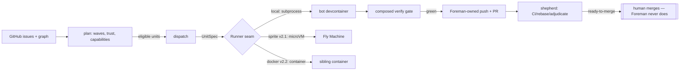

# Architecture

How the system is built, secured, governed, and tested — plus the **subject
hubs** below. The deep dive lives in [foreman.md](foreman.md); this page is
the map.

## Overview

Foreman is a deterministic supervisor: plain code decides scheduling,
readiness, verification, doneness, and trust; LLM agents only produce
artifacts that deterministic gates measure. Where a unit executes is a config
flip behind one **Runner seam** (`local` / `sprite` / `docker`), and the seam
must not leak — policy code consumes advertised **capabilities**, never a
runner name.

## Components

Everything lives in the `foreman` package under `src/foreman/`:

- **`runner/`** — the seam: `Runner` protocol, `UnitSpec`/`Handle`/
  `ExitStatus`, the handle store and per-unit lock, `create`/`select`, and
  `runner/local.py` (LocalRunner: status-recording spawn wrapper, PID +
  start-time liveness, group kill). The only place a runner name becomes
  behavior.
- **`capabilities.py`** — the computed capability model (docker/ports/
  untrusted-input) and the plan-time refusal composer.
- **`trust.py`** — the D4 repo predicate and D13 per-unit classification.
- **`gate.py` + `verify.py`** — composition of the `[verify]` gate and its
  execution.
- **`handoff.py`** — commit-return strategies (v2.0: shared worktree; the
  workflow-diff tripwire lives here).
- **`dispatch.py` / `shepherd.py` / `watch.py`** — the supervisor loop.
- **`graph.py` / `inputs.py` / `spec.py`** — units, edges, doneness, human
  inputs, prompt assembly.
- **`github.py`** — the entire GitHub mutation surface, write-contract-guarded.
- **`backend.py` + `backends/*.sh`** — the agent-adapter vendor seam.
- **`preflight.py`** — the empirical security-assertion gate (`foreman
  preflight`).

## Data Flow

Inputs are stored (issue bodies, labels/fields, comments); machine state is
re-derived from GitHub + git every tick and never stored. A crash mid-wave is
safe: the rerun re-derives state, takes the per-unit lock, probes the
persisted handle's liveness, and reattaches rather than redispatching. Commits
return to Foreman through the handoff strategy and Foreman — never the agent —
pushes with the write token.

## Subject hubs

Each synthesizes what's scattered across config, settings, and state, then routes
onward (diagrams and component deep-dives also live here):

- [ci-cd.md](ci-cd.md) — the pipeline across YAML, runners, and deploy platforms; routes to the release decision and the deploy guide.
- [security.md](security.md) — the posture across config, secret state, and GitHub settings; holds the threat-model framing, not the config.
- [branch-protection.md](branch-protection.md) — in-repo (CODEOWNERS) + out-of-repo (ruleset, Actions toggles, bot model) stitched into one picture (grep can't see GitHub settings).
- [tests.md](tests.md) — the testing strategy holistically (shape, layers, what's tested where); routes to the testing decision and the guides.
