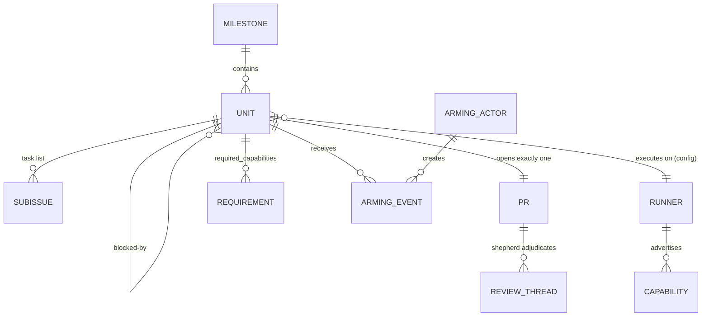
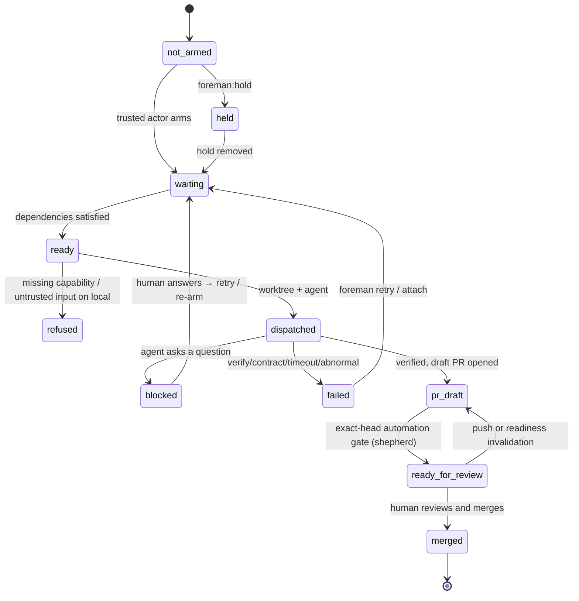

# Domain model

The conceptual model of Foreman — the core concepts, how they relate, their
lifecycles, and the business rules that govern them. This is the shared
**ubiquitous language**: name things here the same way they are named in code,
specs, and conversation. (Quick lookups also live in
[../glossary.md](../glossary.md).)

## Concepts

| Concept | Definition |
|---|---|
| **Target** | What a run is pointed at: a **milestone** (all its issues) or a single **issue** (with its sub-issues). |
| **Unit** | The atom of work: a parent issue = one unit = one PR. Its sub-issues ride along as the unit's internal task list. |
| **Dependency edge** | A `blocked-by` relationship between units (native GitHub dependency, or a `Depends-on: #n` body trailer). |
| **Wave** | The set of open units whose dependencies are all *satisfied* right now — the batch eligible to dispatch. |
| **Arming** | The human authorization to dispatch (and to spend): a **trusted actor** applies the `foreman` input to an issue. Nothing dispatches unarmed. |
| **Trusted actor** | An account (human or bot) in `trusted_actors` whose arming is honored and whose authored content is trusted input. |
| **Runner** | *Where* a unit executes: `local` (subprocess), `sprite` (Fly microVM), `docker` (sibling container). One protocol; selection is config; the choice must not leak into policy code. |
| **Capability** | A property computed per environment — `docker` (a daemon is reachable), `ports` (may bind ports), `untrusted-input` (the boundary can hold a compromised agent). Runners *advertise* capabilities; policy consumes them. |
| **UnitSpec / Handle** | What a runner needs to start a unit (image, workdir, env, cmd, timeout) / an opaque, liveness-checkable reference to the spawned unit, persisted so a restarted Foreman can reattach. |
| **Composed gate** | The verify command list, built from `[verify]` — a baseline plus capability-keyed additions run where their capability is present. |
| **Backend / adapter** | The agent-vendor seam: `backends/<name>.sh` (`run` / `resume` / `capabilities`). Production adapters include Claude Code direct and its fixed-family DeepSeek, Kimi, and GLM wrappers; `mock.sh` is a hermetic seam proof. |
| **Result contract** | The sidecar `result.json` an agent must write (status, summary, handoff, human tasks, AC→test map). Exit-0 without it counts as a crash. |
| **Handoff** | Two senses: the commit-return *strategy* per runner (local shares the worktree; sprite bundles), and the PR `## Handoff` section that carries context to dependent units. |
| **Doneness** | Whether a dependency is satisfied — deterministic, hardened (see rules below). |
| **Shepherd** | The post-PR runbook that keeps open foreman PRs healthy until a human merges. |
| **Signature** | A regex in `signatures.toml` classifying a failure as environmental or a quota-wait *before* any LLM sees it — so an agent never "fixes" infra by weakening code. |
| **Preflight** | The empirical security-assertion gate (`foreman preflight`): probes login, branch rules, read-token, no-workflow-edit, tag immutability. |
| **Vet** | The read-only agent analysis of a target that drafts correction comments for human approval (v1's `preflight`, renamed). |

## Relationships

## Lifecycles

A unit's states from discovery to merge. Foreman drives every transition except
the last — **the human merge** — and re-derives the current state from GitHub +
git on every tick (it is never stored).

## Business rules & invariants

These are what the specs and acceptance criteria enforce
(see [../../specs/foreman-v2.md](../../specs/foreman-v2.md)):

- **One unit = one PR.** A parent issue is the unit; sub-issues are its task
  list, not units.
- **Foreman never merges.** The human merge is the only event that advances the
  graph — permanently, enforced server-side.
- **Arming is required, always.** The actor on the most recent arming event
  must be a trusted actor, on every runner. Authorship *classifies* input
  (untrusted authorship ⇒ the unit requires `untrusted-input`); arming
  *authorizes* it.
- **`local` is trusted-input-only.** Untrusted issue content is refused at plan
  time via the `untrusted-input` capability, which `local` never advertises.
- **Inputs are stored; derived state is never stored.** Handles under
  `.foreman/` are a reattachment cache, not the truth.
- **One status comment per unit: snapshot + append-only event log.** Foreman
  edits a single marker-identified comment in place; below a second marker it
  appends time-stamped, immutable past facts (initiated, PR opened, failed,
  blocked, escalated, ready) newest-first. Provenance, not state — display
  only, never read back for decisions, and nothing a crash can falsify.
- **Doneness is hardened.** A foreman-managed dependency is satisfied only when
  its issue is closed *and* a marker-carrying foreman PR merged into the default
  branch; an external dependency must be closed as *completed*.
- **Plan-affecting config comes from the default branch.** `runner`,
  `trusted_actors`, `required_capabilities`, `[reviewer]`, and `[verify]` are never read from
  a dispatched branch.
- **Version tags are immutable.** Distribution rides on `@vX.Y.Z`, so a moved
  tag is code execution in every consumer.
- **Content is pinned at arming (TOCTOU).** A trusted post-arming edit refreshes
  the pin; an untrusted one breaks the attestation until a trusted actor
  re-arms.
